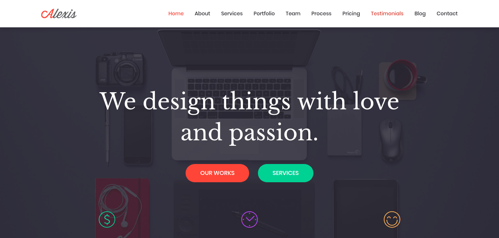
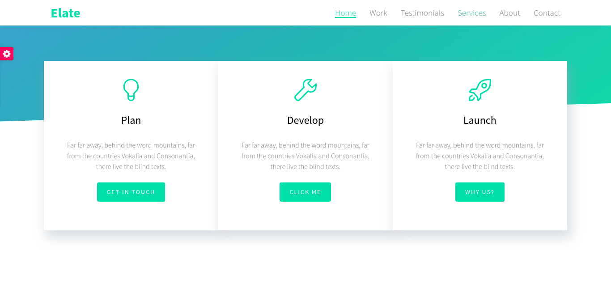
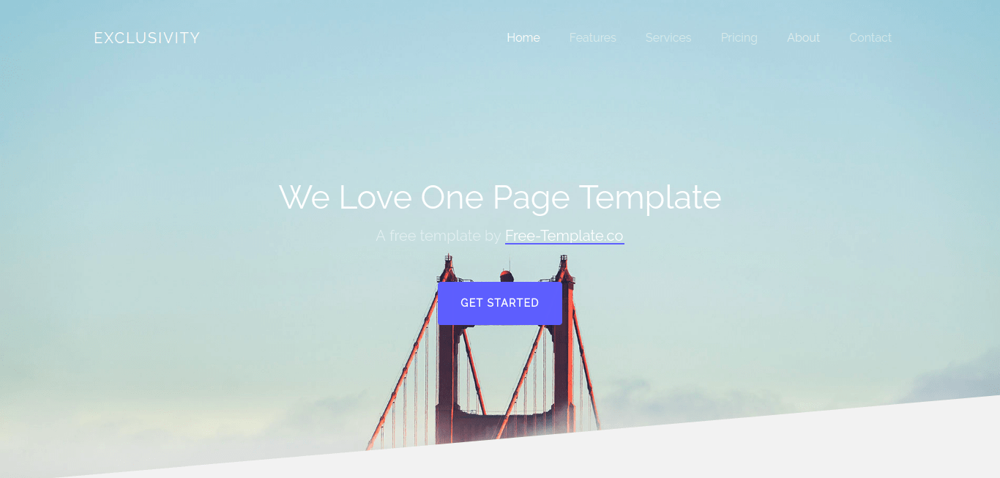

#  Uma coleção de templates para sites

 

Este repositório contém uma coleção de templates para sites reunidas durante o tempo que tenho desenvolvido. 
No paradigma de hoje não é uma boa ideia repetir informações, mas muitos dos templates acabam se perdendo, pois os sites saem do ar.
A ideia é sempre adicionar novos templates. Vamos lá!

> Todos os templates encontrados aqui foram baixados **gratuitamente** pela internet.

#  Templates médicos

Nesta seção temos alguns templates para área de medicina: farmácia, enfermagem, hospital e etc	.

## Health Care

 
 

 

## Doctor

 
 

## Care

 
 

## Infirmary

 
 

## Scientist

 
 

# Medilab

 
 

#  Templates de uso geral

Alguns templates de uso geral, grande parte do tipo *single page*.

## 24 News

 
 

## Alexis Html V1

 
 

## Bright Free Lite

 
 

## Elate

 
 

## Fusion

 
 

## Guide

 
 

## Guri

 
 

## Neat

 
 

## Sedna

 
 

## Starton

 
 

## Bizpage

 
 

## Exclusivity

 
 

## Places

 
 

## Rage

 
 

#  Templates de email

Templates para enviar por email, a grande maioria suporta quase todos os clientes de e-mail.

## Mail Portfolio

 
 

## Slate

 
 

## Newsletter

 
 

#  Autor

Podem me enviar um e-mail se houver alguma dúvida.

* **Charles Gobber** - charles26f@gmail.com
